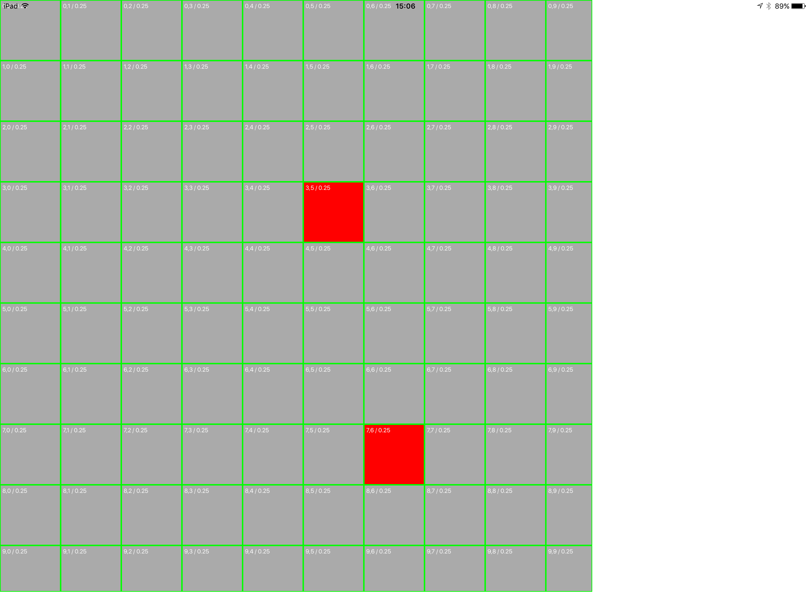

# CATiledLayer shows previous tiles (bug)

_This repository demonstrates a bug in `CATiledLayer`. Under certain conditions, tiles aren't correctly invalidated, instead the wrong versions of tiles are cached._

[`rdar://28648050`](http://www.openradar.me/28648050)

## Details

When invalidating a view backed by a CATiledLayer, a previous tile remains "stuck" and isn't correctly invalidated.

This seems to happen when the view is invalidated (on the main thread), while at the same time, the tile render threads are still working on a previous version of the tile. Instead of caching the new version of the tile, the previous version is cached.

The view backed by CATiledLayer is a subview of a UIScrollView and is zoomable. The rendering of a tile can be expensive and can use the render thread for 10ms.

## Platforms

This has been reproduced when testing with:

- iPhone 6
- iPhone 7 Plus
- iPad Pro 12"
- iOS 9
- iOS 10

# Example

The example code in this repository does the following:

1. Starts rendering all red tiles (this would take about 3 seconds to complete)
2. During rendering (after 800ms), invalidate the complete view (setNeedsDisplay)
3. Start rendering all gray tiles (this again takes about 3 seconds)
4. Two tiles (randomly?) remain red, instead of becoming gray.

_Example screenshot demonstrating two remaing red tiles:_

